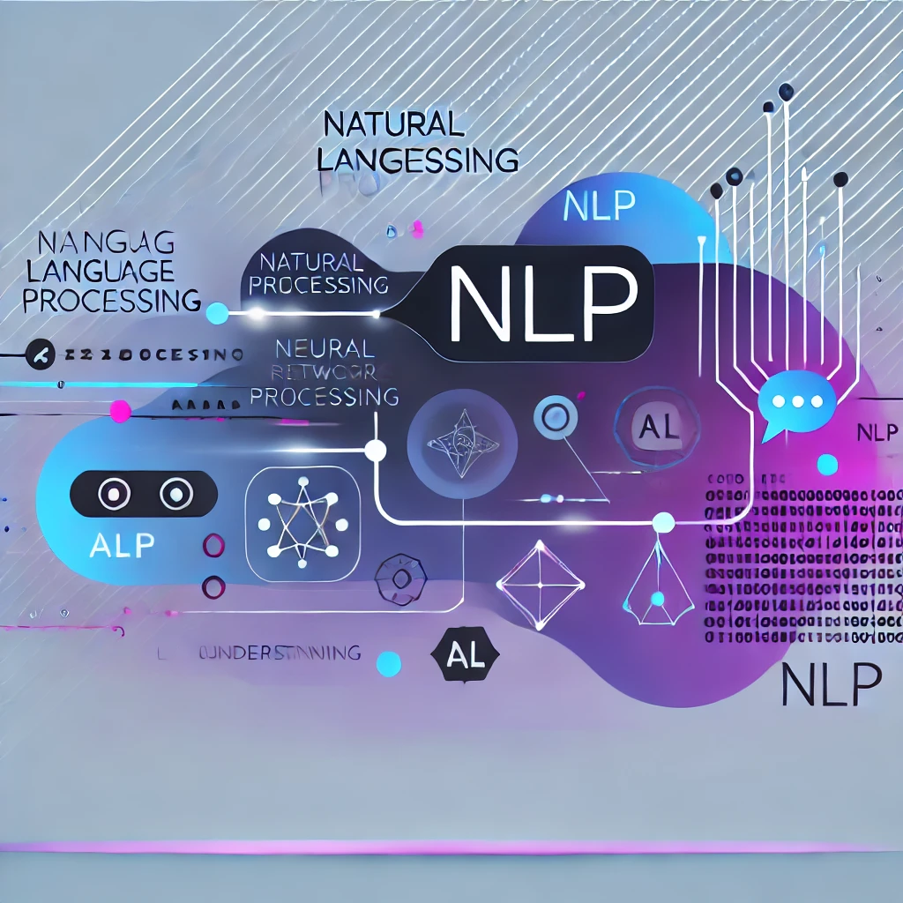

# NLP Repository



## Overview

This repository contains various Natural Language Processing (NLP) projects and tasks using different Python libraries like NLTK and spaCy. The key tasks include text tokenization, part-of-speech (POS) tagging, stemming and lemmatization, named entity recognition (NER), and more. These tasks demonstrate how to preprocess and analyze text data for various NLP applications.

## 1. Project Structure

The repository is organized into different Jupyter notebooks, each demonstrating a different NLP technique or task:

- **Tokenization in SpaCy.ipynb**: Demonstrates tokenization using spaCy.
- **POS_Tagging.ipynb**: Part-of-speech tagging using spaCy.
- **Stemming and Lemmatization.ipynb**: Showcases how stemming and lemmatization are applied.
- **Named entity Recognition.ipynb**: Named entity recognition using spaCy.
- **NLTK vs spaCy.ipynb**: Comparison between NLTK and spaCy for text processing.
- **Language_processing_pipeline.ipynb**: A complete NLP pipeline.
- **regex_nlp.py**: Demonstrates the use of regular expressions for text processing.

## 2. Requirements

Before you start, you need to install the required Python packages. You can install them by running:

```bash
pip install -r requirments.txt
```

Make sure you have all the dependencies installed as outlined in the `requirments.txt` file.

## 3. Run the Jupyter Notebooks

To explore the projects, clone the repository and open the Jupyter notebooks. You can run the notebooks locally by executing:

```bash
jupyter notebook
```

This will open Jupyter in your browser, where you can navigate through the notebooks.

## 4. Key NLP Tasks

### Tokenization
- Tokenization is the process of breaking down text into individual words or tokens.
- Check out `Tokenization in SpaCy.ipynb` to see tokenization in action.

### POS Tagging
- POS tagging assigns part of speech labels to words (e.g., noun, verb).
- Explore `POS_Tagging.ipynb` for more details.

### Named Entity Recognition (NER)
- NER helps in identifying and classifying named entities (like organizations, places, and people) in text.
- Refer to `Named entity Recognition.ipynb` for practical implementation.

### Stemming and Lemmatization
- Stemming reduces words to their root form by removing suffixes, whereas lemmatization reduces words to their dictionary form.
- Check out `Stemming and Lemmatization.ipynb` to understand this process better.

### Regular Expressions in NLP
- Regular expressions are useful for text manipulation and pattern matching.
- See `regex_nlp.py` for more on regex in NLP.

## 5. Contributing

If you'd like to contribute, feel free to fork this repository, create a new branch, and submit a pull request. Make sure to follow proper code guidelines and ensure that your code passes all tests before submitting.

## 6. License

This repository is licensed under the MIT License. Feel free to use and modify the code, but please provide proper attribution.

